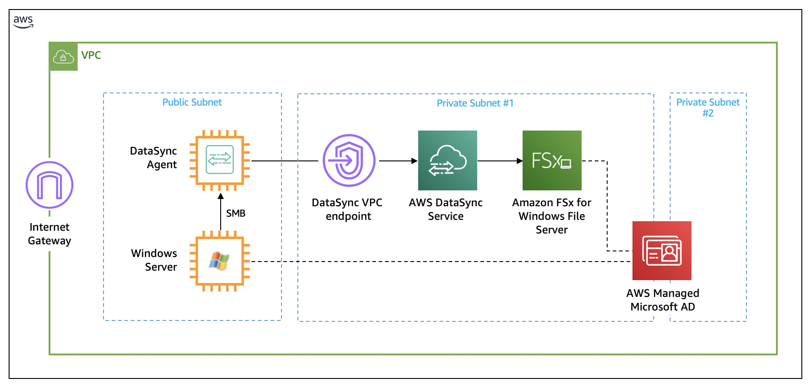
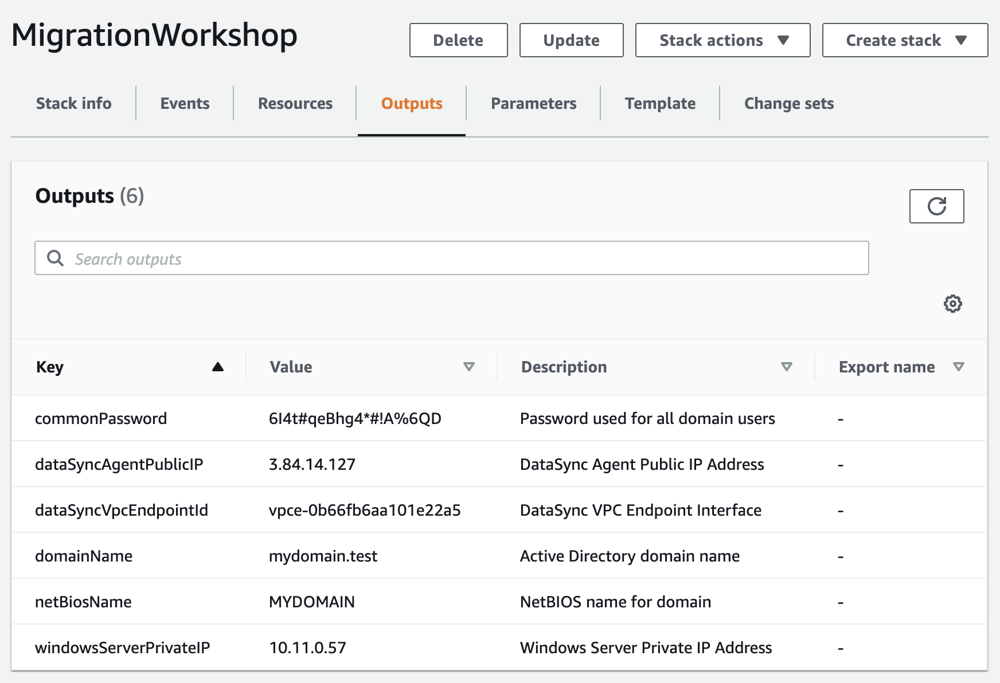

# Migrate to FSx Windows File Server using AWS DataSync

© 2020 Amazon Web Services, Inc. and its affiliates. All rights reserved.
This sample code is made available under the MIT-0 license. See the LICENSE file.

Errors or corrections? Contact [jeffbart@amazon.com](mailto:jeffbart@amazon.com).

---

# Module 1
## Deploy resources

In this module you will deploy all AWS resources necessary to complete this workshop using AWS CloudFormation.  The resources include an Active Directory domain, a Windows server, a DataSync agent, and an FSx file system, all within a single VPC.  The resources are organized along subnets.  There is one public subnet and two private subnets. The public subnet represents resources that would normally reside on-premises.  The private subnets hold resources that would reside in AWS.  DataSync transfers data from the Windows Server to FSx through a VPC endpoint and the DataSync managed service located in the region.  Both the Windows Server and the FSx file system connect to the Active Directory domain, which is an AWS Managed Microsoft AD instance.

It will take approximately 45 minutes to deploy all resources using CloudFormation.

## Module Steps

#### 1. Deploy AWS resources

1. Click one of the launch links in the table below to deploy workshop resources using CloudFormation.  To avoid errors during deployment, select a region in which you have previously created AWS resources.

  | **Region Code** | **Region Name** | **Launch** |
  | --- | --- | --- |
  | us-west-1 | US West (N. California) | [Launch in us-west-1](https://console.aws.amazon.com/cloudformation/home?region=us-west-1#/stacks/new?stackName=MigrationWorkshop&amp;templateURL=https://aws-datasync-samples.s3-us-west-2.amazonaws.com/workshops/fsxw-migration/datasync-fsx-windows-migration.yaml) |
  | us-west-2 | US West (Oregon) | [Launch in us-west-2](https://console.aws.amazon.com/cloudformation/home?region=us-west-2#/stacks/new?stackName=MigrationWorkshop&amp;templateURL=https://aws-datasync-samples.s3-us-west-2.amazonaws.com/workshops/fsxw-migration/datasync-fsx-windows-migration.yaml) |
  | us-east-1 | US East (N. Virginia) | [Launch in us-east-1](https://console.aws.amazon.com/cloudformation/home?region=us-east-1#/stacks/new?stackName=MigrationWorkshop&amp;templateURL=https://aws-datasync-samples.s3-us-west-2.amazonaws.com/workshops/fsxw-migration/datasync-fsx-windows-migration.yaml) |
  | us-east-2 | US East (Ohio) | [Launch in us-east-2](https://console.aws.amazon.com/cloudformation/home?region=us-east-2#/stacks/new?stackName=MigrationWorkshop&amp;templateURL=https://aws-datasync-samples.s3-us-west-2.amazonaws.com/workshops/fsxw-migration/datasync-fsx-windows-migration.yaml) |
  | eu-west-1 | Ireland | [Launch in eu-west-1](https://console.aws.amazon.com/cloudformation/home?region=eu-west-1#/stacks/new?stackName=MigrationWorkshop&amp;templateURL=https://aws-datasync-samples.s3-us-west-2.amazonaws.com/workshops/fsxw-migration/datasync-fsx-windows-migration.yaml) |
  | eu-central-1 | Frankfurt | [Launch in eu-central-1](https://console.aws.amazon.com/cloudformation/home?region=eu-central-1#/stacks/new?stackName=MigrationWorkshop&amp;templateURL=https://aws-datasync-samples.s3-us-west-2.amazonaws.com/workshops/fsxw-migration/datasync-fsx-windows-migration.yaml) |
  | ap-northeast-1 | Tokyo | [Launch in ap-northeast-1](https://console.aws.amazon.com/cloudformation/home?region=ap-northeast-1#/stacks/new?stackName=MigrationWorkshop&amp;templateURL=https://aws-datasync-samples.s3-us-west-2.amazonaws.com/workshops/fsxw-migration/datasync-fsx-windows-migration.yaml) |

2. Click **Next** on the Create Stack page.
3. Keep the Stack Name as-is. Under the **Parameters** section, select an EC2 key pair to allow for SSH and RDP login to instances created by this stack. Enter a name for the domain, along with a NetBIOS name.  The common password will be applied to all users that will be created by the stack.  The password must be at least 8 characters long and include letters, numbers, and at least one symbol.  Do not edit the values for AMI IDs.  When you are done, click **Next**.
4. Click **Next** again. (skipping the Options and Advanced options sections)
5. On the Review page, scroll to the bottom and check the box to acknowledge that CloudFormation will create IAM resources, then click  **Create stack**.

Wait for the CloudFormation stack to reach the CREATE\_COMPLETE state before proceeding to the next steps.  It will take about **45 minutes** for the CloudFormation stack to complete.

**NOTE:** If the stack fails to deploy because an EC2 instance type is not available in a particular availability zone, delete the stack and retry in the same region or in a different region.

#### 3. Stack Outputs

Upon completion, each CloudFormation stack will have a list of &quot;Outputs&quot;.  These are values such as IP addresses and resource names that will be used throughout the workshop.  You can either copy these values elsewhere or keep the page open in your browser and refer to them as you go through the workshop.

On the CloudFormation page , click on the **Outputs** tab, as shown in the image below.  You should see the following values listed:

- **commonPassword** – This is the password that is used for all Active Directory users.  Any time you are required to enter a password, it will be this one.
- **dataSyncAgentPublicIP** – This is the public IP address of the EC2 instance running the DataSync agent.  You will use this when activating the DataSync agent.
- **dataSyncVpcEndpointId** - This is the ID of the DataSync VPC endpoint.  You will use this when activating the DataSync agent.
- **domainName** – This is the full name of the Active Directory domain that you entered as a parameter when the stack was being created.
- **netBiosName** – This is the NetBIOS name of the Active Directory domain that you entered as a parameter when the stack was being created.
- **windowsServerPrivateIp** – This is the private IP address of the EC2 instance running the Windows Server .  You will copy data from this server to FSx for Windows using DataSync.

## Validation Step

Open a new tab in your browser and navigate to the AWS management console for FSx.  You should see a new file system created named "DataSync FSx workshop".  Go to the EC2 console page and you should see two new EC2 instances named "Windows-Server" and "DataSyncAgent".

If you do not see these resources, verify that the CloudFormation stack completed with state "CREATE_COMPLETE".

## Module Summary

In this module, you deployed all resources necessary to complete this workshop and verified that resources were deployed correctly.

In the next module, you will prepare the data on the Windows Server for sharing, so it can be copied to your FSx file system.

Go to [Module 2](../module2).
