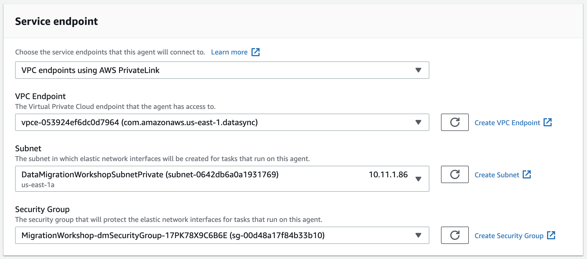
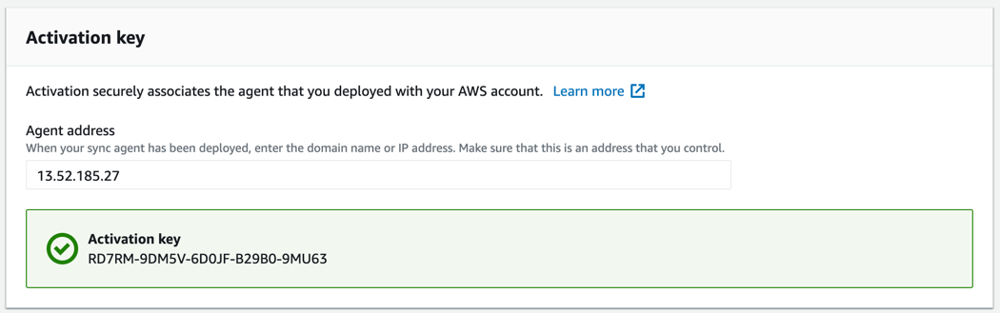
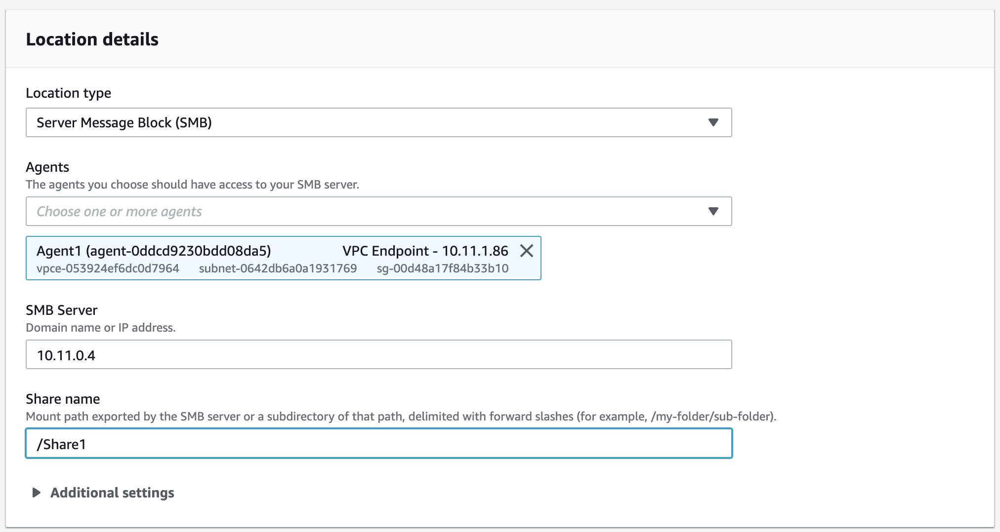
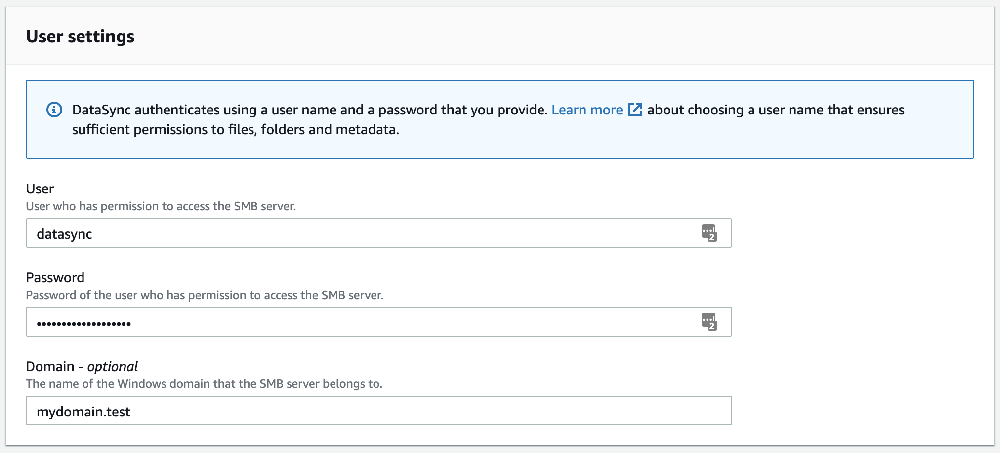
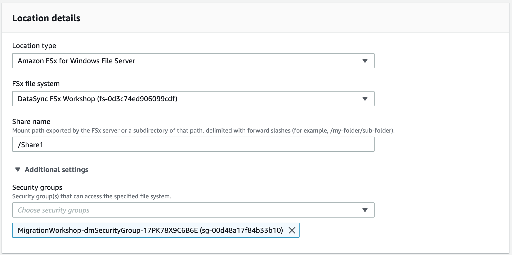
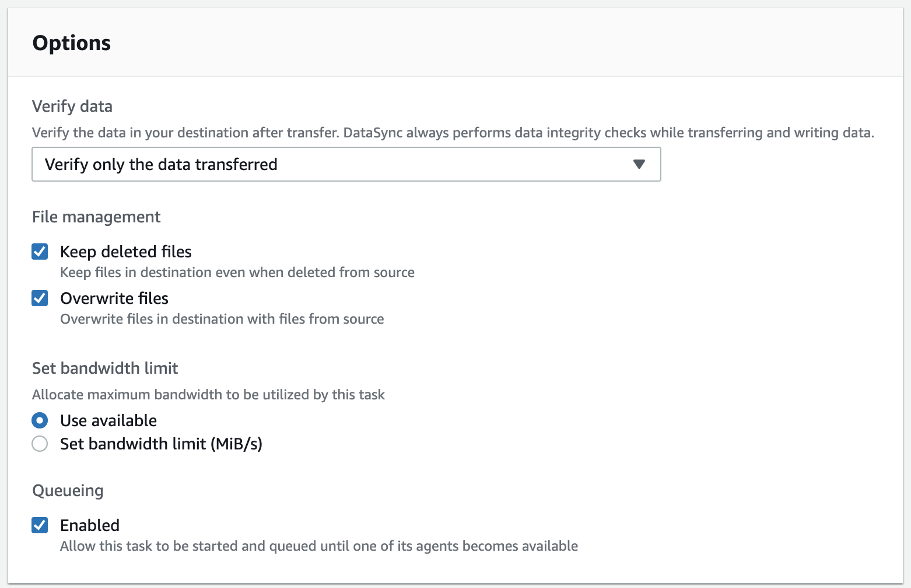
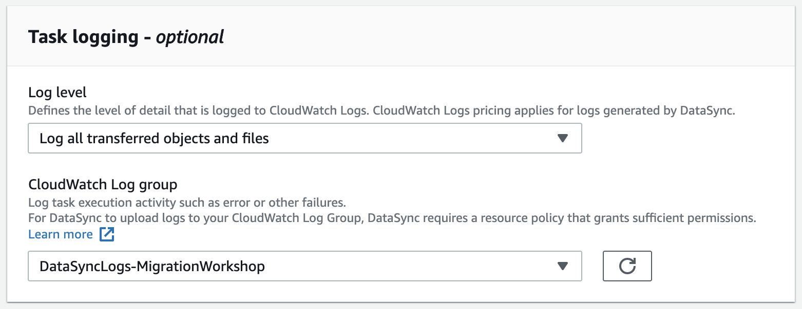
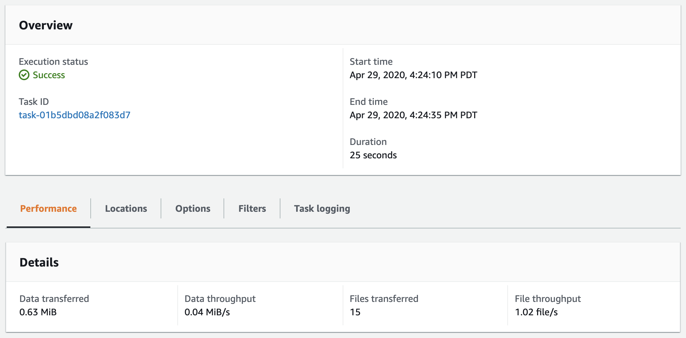
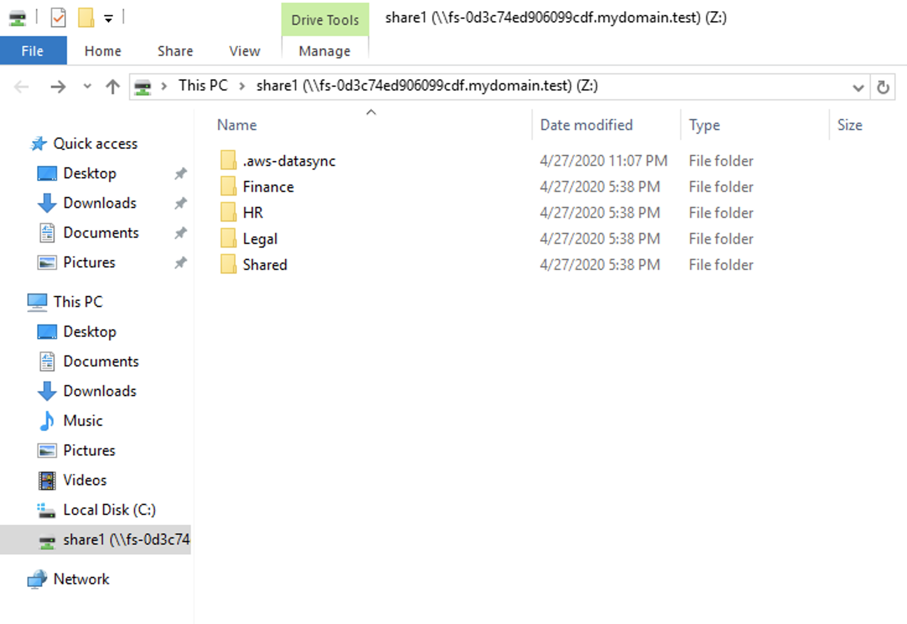

# Migrate to FSx Windows File Server using AWS DataSync

© 2020 Amazon Web Services, Inc. and its affiliates. All rights reserved.
This sample code is made available under the MIT-0 license. See the LICENSE file.

Errors or corrections? Contact [jeffbart@amazon.com](mailto:jeffbart@amazon.com).

---

# Module 3
## Copy files from the Windows Server to FSx using DataSync

In the previous module, you created network shares on both the Windows Server and FSx.  AWS DataSync uses network shares to access data on file systems.  In this module, you will prepare DataSync for the transfer. First, you will setup CloudWatch so that it can accept logs from DataSync.  You will then activate your DataSync agent and configure it for VPC access.  You will then configure DataSync with a new task that will copy data from the Windows Server to FSx.

## Module Steps

#### 1. Configure CloudWatch to allow DataSync logging

When you create a DataSync task, it can be configured to write logs to a CloudWatch log group.  If there are any issues during the transfer then a log entry will be created for each problematic file, allowing you to investigate once the DataSync task completes.  However, before DataSync can write logs to CloudWatch, it must first be configured with the proper resource policy. Note that the steps below only need to be done once per AWS region where you will run DataSync.

1. Copy the text for the policy below into an editor and save it as a file on your local machine:

        {
            "Statement": [
                {
                    "Sid": "DataSyncLogsToCloudWatchLogs",
                    "Effect": "Allow",
                    "Action": [
                        "logs:PutLogEvents",
                        "logs:CreateLogStream"
                    ],
                    "Principal": {
                        "Service": "datasync.amazonaws.com"
                    },
                    "Resource": "*"
                }
            ],
            "Version": "2012-10-17"
        }

2. From your command-line terminal, run the following command to apply the policy to CloudWatch:

        aws logs put-resource-policy --region <region> --policy-name trustDataSync --policy-document file://<policy-file>

  where \<policy-file\> is the file on your local machine that was created in step #1 above and \<region\> is the AWS region you are using for the workshop.

#### 2. Activate the DataSync agent

Although the EC2 instance running the DataSync agent was deployed in the first module, before they can be used they first need to be activated.  Follow the steps below to active the agent.

1. Go to the AWS Management console page, click  **Services**, then select  **DataSync.**
2. If no DataSync agent exists, click the **Get started** button, otherwise click the **Create agent** button.
3. For the Service endpoint, select **VPC endpoints using AWS PrivateLink**.  This will limit all DataSync traffic to the VPC in which the agent is running.  This is useful when you have an AWS DirectConnect or VPN connection from your on-premises environment into AWS.  For more information on configuring DataSync for VPC access, check out [this documentation](https://docs.aws.amazon.com/datasync/latest/userguide/datasync-in-vpc.html).
4. For the VPC Endpoint, select the endpoint ID that matches the ID in the CloudFormation outputs tab.  The VPC has only one subnet and one security group - both will automatically be selected for you.

    

4. Under the **Activation key** section, enter the **Public IP address** of the DataSync agent. You can get this IP address from the CloudFormation output.  You use the public IP address here because the agent needs to be accessible by your web browser for activation.  You could also use a Private IP address for activation if your browser could route to it. Enter the public IP address of the agent then click **Get key.**

5. Once the activation is successful, you will be shown the activation key and will be prompted for further information.

    

6. Enter a name for the Agent and apply any tags if desired, then click **Create agent**.

#### 3. Create the source location

DataSync copies data from a source location to a destination location.  Locations exist independent of tasks and can be re-used if needed.

1. On the left side of the page, select **Locations** then click on the **Create location** button.
2. Under the **Location Type** select "Server Message Block (SMB)".
3. Select the agent you just created in the previous step.  Under **SMB Server**, enter the **Private IP address** of the Windows Server, which you can find in the CloudFormation outputs.  Under **Share name** enter "/Share1".

    

4. Under **User settings**, for **User**, enter "datasync".  For **Password** enter the common password you created as part of CloudFormation.  For **Domain** enter the full domain name, found in the CloudFormation outputs.  These are the user credentials that AWS DataSync will use to access the network share on the Windows Server.

    

5. Click on **Create location**

The **datasync** AD user was created automatically in the CloudFormation stack and has been configured to be part of the AWS Delegated FSx Administrators group.  This is important because the user that DataSync uses must have the rights to read and set all fields of the ACL.  In an AWS Managed AD environment, the AWS Delegated FSx Administrators group provides such rights.  In a self-managed AD environment, such rights come through the Domain Admins group or the Backup Operators group.

#### 3. Create the destination location

1. On the left side of the page, select **Locations** then click on the **Create location** button.
2. Under the **Location Type** select "Amazon FSx for Windows File Server".
3. Select the FSx file system named "DataSync FSx Workshop".
4. For the **Share name** enter "/share1".
5. Expand **Additional settings**.  Remove the default security group and select the security group named "MigrationWorkshop-dmSecurityGroup".  This will provide the necessary access from the DataSync service to the FSx file server.

    

5. Under **User settings** use the same credentials you provided for the SMB location for the Windows Server.
6. Click on **Create location**

#### 4. Create the DataSync task

1. Click on the **Create task** button
2. Select "Choose and existing location" and then select the SMB location you created earlier.  This is the source location.
3. Click **Next**
4. Select "Choose an existing location" and then select the FSx location you created earlier.  This is the destination location.
5. Click **Next**
6. Give the task a name.  Under the Verify data option, make sure that "Verify only the data transferred" option is selected.  This will verify data at the destination in the most optimal way.  Leave the other Options as-is.

    

7. Scroll down to the **Task logging** section.  Under **Log level**, select "Log all transferred objects and files".  Under **CloudWatch Log group**, select the group named "DataSyncLogs-MigrationWorkshop".

    

8. Click **Next**.
9. Verify all task settings then click on **Create task**.

#### 2. Run the DatsSync task

1. Wait for the **Task status** to transition from "Creating" to "Available".
2. To run the task, click the **Start** button, verify the settings one more time, and then click **Start**.
3. The task will immediately go into the &quot;Running&quot; state.
4. Under the **History** tab, click on the task execution object in the list.
5. As the task runs, the execution status will progress from &quot;Launching&quot; to &quot;Preparing&quot; to &quot;Transferring&quot; to &quot;Verifying&quot; and finally to &quot;Success&quot;.  Once the task completes, the console will report statistics on the job, as shown below.

    

## Validation Step

Return to the Windows Server remote desktop session.  In the Windows Explorer window for the FSx share, you should now see an exact copy of the files and folders from the share1 folder on the Windows Server.  You should also see a folder name ".aws-datasync", which was created by DataSync as part of the migration process.

If you check the security properties on the various files and folders you will find that they exactly match those on Windows Server share1 folder.

## Module Summary

In this module, you comfigured DataSync, activated your agent, and then successfully made a full copy of data from the Windows Server to the FSx file system.  After the copy was complete, you validated that the data was successfully copied to FSx.

While this workshop only copied a small amount of data into FSx, DataSync is built to scale easily and efficiently.  AWS customers have used DataSync to copy petabytes of data from on-premises systems into AWS cloud storage, including Amazon S3, Amazon EFS, and Amazon FSx.  Head to the [DataSync product pages](https://aws.amazon.com/datasync/) to learn more about how AWS DataSync can help you with your data migration projects.

In the next module, you will cleanup all resources created in this workshop.

Go to [Module 4](../module4).
