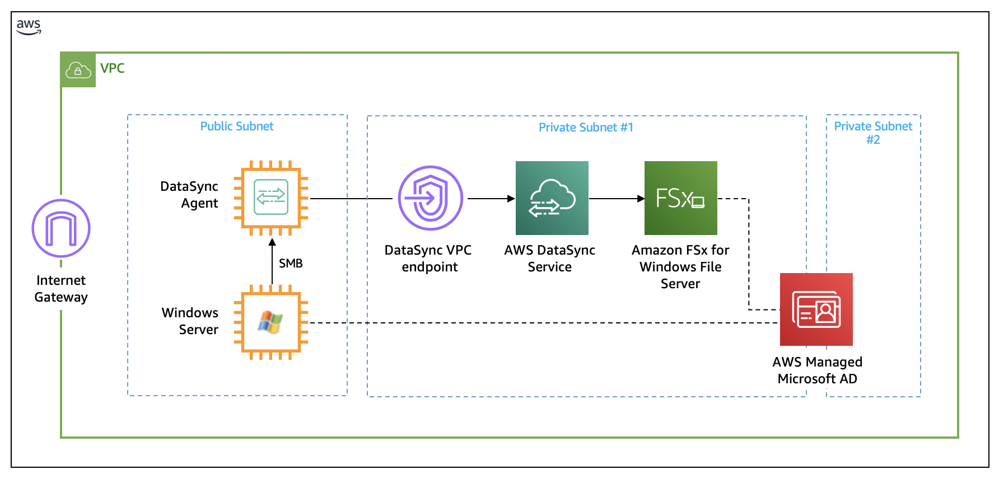

# DataSyncを使ったFSx for Windows File Serverへのマイグレーション

© 2020 Amazon Web Services, Inc. and its affiliates. All rights reserved.
This sample code is made available under the MIT-0 license. See the LICENSE file.

Errors or corrections? Contact [jeffbart@amazon.com](mailto:jeffbart@amazon.com).

---

# Module 1
## クラウドフォーメーションを使用したリソースのデプロイ

このモジュールでは、ワークショップに必要な全てのAWSリソースのデプロイをクラウドフォーメーションを使って行います。リソースとしてアクティブディレクトリドメイン、Windowsサーバー、DataSyncエージェント、FSxファイルシステムが1つのVPC内に構成されます。 これらのリソースはサブネットに紐付けされます。サブネットは1つのパブリックサブネットと2つのプライベートサブネットで構成されます。パブリックサブネットは通常オンプレミス側に存在するリソースを擬似したものになります。プライベートサブネットにはAWS側のリソースを表現しています。DataSyncはVPCエンドポイントとリージョン内のDataSyncマネージドサービスを通じて、WindowsサーバーのデータをFSxに転送します。 Windowsサーバー、FSxファイルシステム共に、AWSマネージドMicrosoft ADインスタンスで構成されたアクティブディレクトリドメインに参加します。

このクラウドフォーメーションによる全てのリソースのデプロイ完了にはおよそ45分かかります。

## このモジュールの手順

#### 1. AWSリソースのデプロイ

1. クラウドフォーメーションを使用してリソースをデプロイするために、以下の中からリンクを選択し、クリックして下さい。 デプロイ中のエラーを回避するために、以前にリソースを作成した事の有るリージョンの選択を推奨します。
（＊右クリックを使って別の窓で開くと、このワークショップの手順を残しておけるので便利です）

  | **リージョンコード** | **リージョン名** | **起動リンク** |
  | --- | --- | --- |
  | us-west-1 | US West (N. California) | [us-west-1へデプロイ](https://console.aws.amazon.com/cloudformation/home?region=us-west-1#/stacks/new?stackName=MigrationWorkshop&amp;templateURL=https://aws-datasync-samples.s3-us-west-2.amazonaws.com/workshops/fsxw-migration/datasync-fsx-windows-migration.yaml) |
  | us-west-2 | US West (Oregon) | [us-west-2へデプロイ](https://console.aws.amazon.com/cloudformation/home?region=us-west-2#/stacks/new?stackName=MigrationWorkshop&amp;templateURL=https://aws-datasync-samples.s3-us-west-2.amazonaws.com/workshops/fsxw-migration/datasync-fsx-windows-migration.yaml) |
  | us-east-1 | US East (N. Virginia) | [us-east-1へデプロイ](https://console.aws.amazon.com/cloudformation/home?region=us-east-1#/stacks/new?stackName=MigrationWorkshop&amp;templateURL=https://aws-datasync-samples.s3-us-west-2.amazonaws.com/workshops/fsxw-migration/datasync-fsx-windows-migration.yaml) |
  | us-east-2 | US East (Ohio) | [us-east-2へデプロイ](https://console.aws.amazon.com/cloudformation/home?region=us-east-2#/stacks/new?stackName=MigrationWorkshop&amp;templateURL=https://aws-datasync-samples.s3-us-west-2.amazonaws.com/workshops/fsxw-migration/datasync-fsx-windows-migration.yaml) |
  | eu-west-1 | Ireland | [eu-west-1へデプロイ](https://console.aws.amazon.com/cloudformation/home?region=eu-west-1#/stacks/new?stackName=MigrationWorkshop&amp;templateURL=https://aws-datasync-samples.s3-us-west-2.amazonaws.com/workshops/fsxw-migration/datasync-fsx-windows-migration.yaml) |
  | eu-central-1 | Frankfurt | [eu-central-1へデプロイ](https://console.aws.amazon.com/cloudformation/home?region=eu-central-1#/stacks/new?stackName=MigrationWorkshop&amp;templateURL=https://aws-datasync-samples.s3-us-west-2.amazonaws.com/workshops/fsxw-migration/datasync-fsx-windows-migration.yaml) |

2. Create Stackページで**Next**をクリック。
3. Stack Nameはそのままにしてください。**Parameters**セクションで、 このスタックで作成したインスタンスへSSHとRDPでログインするために、EC2キーペアを選択してください。NetBIOS名と共にドメイン名を入力してください。共通パスワードはスタックによって作成された全てのユーザーに適用されます。パスワードは必ず文字、数字、最低１文字の符号を含み、合計８文字以上で有る必要が有ります。AMI IDsは変更しないでください。全てを入力したら**Next**をクリック。
4. もう一度**Next**をクリック。 (オプションと高度な設定のセクションはスキップします)
5. レビューページで最下部までスクロールし、クラウドフォーメーションがIAMリソースを作成する事を許可するチェックボックスにチェックを入れ、**Create stack**をクリック。

次のステップに進む前にクラウドフォーメーションスタックのステータスがCREATE\_COMPLETEになるまでお待ちください。完了まで**45 分**程度かかります。

**注意:** もし特定のアベイラビリティゾーンでEC2インスタンスタイプが対応しておらず、スタックのデプロイに失敗する場合は、一度スタックを削除し、もう一度 試す、または別のリージョンでデプロイして下さい。

#### 3. スタックアウトプット

完了後、クラウドフォーメーションスタックは実行結果の&quot;アウトプット（出力）&quot;のリストを表示します。IPアドレスやリソース名等のこれらの情報はワークショップを通して使用します。これらの情報をコピーしておくか、このページをブラウザで表示したままワークショップを進めると、スムーズに進行出来ます。

クラウドフォーメーションページで**アウトプット（出力）**をクリックすると以下のような項目を確認出来ます。

- **commonPassword** – 全てのアクティブディレクトリーユーザーで使用されるパスワードです。パスワードを要求されたらこれを入力してください。
- **dataSyncAgentPublicIP** – DataSyncエージェントが動作するEC2インスタンスのパブリックIPアドレスです。DataSyncエージェントをアクティベートする時に使用します。
- **dataSyncVpcEndpointId** - DataSync VPNエンドポイントのIDです。DataSyncエージェントをアクティベートする時に使用します。
- **domainName** – クラウドフォーメーションスタック作成時に入力したパラメーターで、アクティブディレクトリのドメイン名です。 
- **netBiosName** – クラウドフォーメーションスタック作成時に入力したパラメーターで、アクティブディレクトリのNetBIOS名です。
- **windowsServerPrivateIp** – Windowsサーバーが動作するEC2インスタンスのプライベートIPアドレスです。このサーバーからFSxへDataSyncを使ってデータをコピーします。

## 最後に確認

ブラウザで新しいタブを開き、FSxのAWSマネジメントコンソールにアクセスしてください。"DataSync FSx workshop"という名の新しいファイルシステムが見えるはずです。次にEC2コンソールのページにアクセスし、"Windows-Server"と"DataSyncAgent"という2つのインスタンスが見えるのを確認してください。

もしこれらのリソースが見えない場合、クラウドフォーメーションスタックのステータスが"CREATE_COMPLETE"になっている事を確認してください。

## このモジュールのまとめ

このモジュールでは、ワークショップに必要な全てのリソースをデプロイし、その後正常にデプロイされている事の確認を行いました。

次のモジュールでは、FSxファイルシステムにコピーするためのWindowsサーバーでの共有データを準備します。

[モジュール 2](/module2)へ
