# DataSyncを使ったFSx for Windows File Serverへのマイグレーション

© 2020 Amazon Web Services, Inc. and its affiliates. All rights reserved.
This sample code is made available under the MIT-0 license. See the LICENSE file.

Errors or corrections? Contact [jeffbart@amazon.com](mailto:jeffbart@amazon.com).

---

# モジュール 2
## WindowsファイルサーバーとFSxでのファイル共有の構成

前のモジュールで、クラウドフォーメーションを使って様々なAWSリソースをデプロイしました。これにはAWSマネージドMicrosoft ADを使ったアクティブディレクトリドメイン、Windowsサーバー、FSx for Windowsファイルシステムが含まれます。Windowsサーバーのデプロイと同時に、基本的な部門のフォルダーを模擬した小さなフォルダー構造が構成されています。このモジュールでは、このフォルダーをWindowsサーバー上のファイル共有として構成します。また、FSx for Windows上にも新しい共有を作成し、セキュリティとパーミッションの設定が適切に行われている事を確認します。これらの手順が完了すると、AWS DataSyncを使ってWindowsサーバーからFSxへデータをコピーする準備が整います。

## このモジュールの手順

#### 1. Windowsサーバーへログイン
Windowsサーバーへログインするためにはリモートデスクトップクライアントが必要です。これはほとんどのバージョンのWindowsとMacOSでデフォルトで使用可能です。

1. EC2コンソールからWindows-Serverインスタンスを選択し、**接続**ボタンをクリックしてください。**リモートデスクトップファイルのダウンロード**ボタンをクリックしてください。
2. ダウンロードしてリモートデスクトップファイルを開き、ユーザー名には"MYDOMAIN\Admin"（"MYDOMAIN"部分はNetBIOS名と置き換え。""\""と"?"は明確に区別されるので注意して下さい。リモートデスクトップクライアントによっては"ユーザー名"@"ドメイン名"の形式でもログイン出来ます。）を入力してください。パスワードはクラウドフォーメーションスタックを作成する時に入力したものを使用してください。NetBIOS名とパスワードは、クラウドフォーメーションのアウトプット（出力）配下で確認出来ます。

    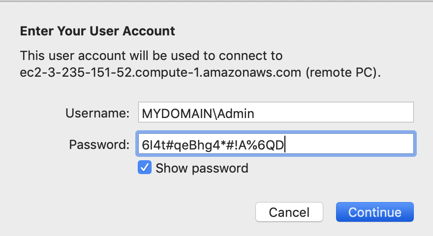

#### 2. 部門フォルダーの確認

1. RDP接続したWindowsでエクスプローラーを開き、Cドライブをクリックしてください。Cドライブのトップレベルに"share1"という名前のフォルダが確認出来ます。このワークショップのゴールはこのフォルダー内のコンテンツをFSxにコピーする事です。

2. share1フォルダーを右クリックし**Properties**を選択、**Security**タブをクリックし、次に**Advanced**ボタンをクリックしてください。share1フォルダーのパーミッションに関する情報が表示されます。これはファイルやフォルダーのアクセスコントロールリスト（ACL）を確認する一つの方法です。

    

    このフォルダーには3つのパーミッションエントリーが設定されています。1つはWindows SYSTEMユーザー、1つはアクティブディレクトリドメインユーザーグループ、そしてAWS Delegated FSx Administratorsと呼ばれるグループです。この最後のグループはAWSマネージドADサービスによって自動的に作成され、ドメイン管理者グループと同等の権限を持ちます。

    ウィンドウの上部にはフォルダーのオーナーに関する情報（この場合はアクティブディレクトリAdminユーザー）を確認する事が出来ます。 ほとんどの場合、フォルダやファイルのオーナーは作成時のアカウントの名前になります。

4. セキュリティウィンドウを閉じ、share1フォルダを開いてください。Finance、HR、Legal、Sharedの4つのフォルダーを確認できます。それぞれのフォルダーは複数のサブフォルダーとファイルで構成されます。

    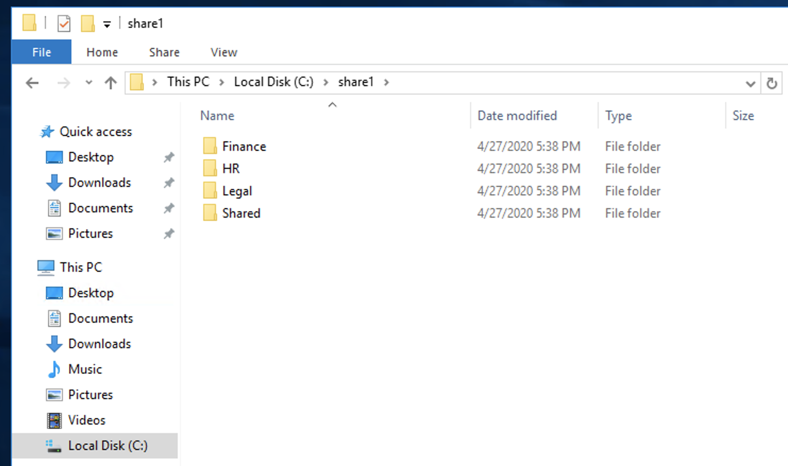

    前のステップと同じ手順でフォルダーの1つを右クリックし、セキュリティプロパティを確認します。例えば以下はFinanceフォルダーで行った例です。

    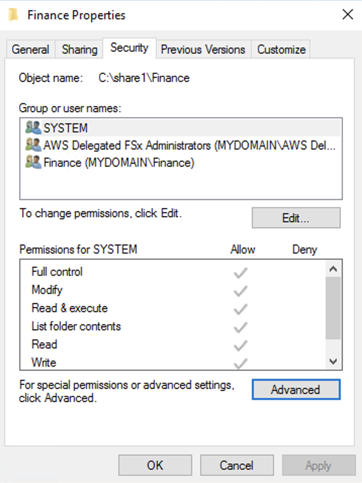

    ドメインユーザーが無く、ファイナンスグループの新しいエントリがある事に注目してください。このケースではファイナンスフォルダーには全てのドメインユーザーではなく、ファイナンスグループのメンバーだけが見る事ができるデータが含まれます。

何故ファイルのセキュリティーパーミッションを気にする必要が有るのでしょうか？AWS DataSyncの利点の一つとしてファイルのデータだけでなく、パーミッションやタイムスタンプ、その他のファイルやフォルダーメタデータもコピーされるという点があります。事実、AWS DataSyncはファイルシステムの完全なコピーを宛先に作成します（この場合はFSxです）。この機能は有る場所から別の場所へデータをマイグレーションする際に非常に重要で、DataSyncはあなたの代わりにこの面倒な処理を全てケアしてくれます。

#### 3. Windowsサーバーでファイル共有の作成

Windowsサーバーからデータをコピーするために、AWS DataSyncはSMBプロトコルをサポートするネットワーク共有が必要です。ネットワーク共有の作成には次の手順に従ってください。

1. 左下のWindows起動アイコンをクリックし、"powershell"と入力してください。メニューが現れ、最上部にWindows PowerShell applicationが表示されるはずです。アプリケーションを右クリックし、**Run as Administrator**を選択してください。これはPowerShellコンソールを管理者権限で実行し、ネットワーク共有を作成するのに必要な手順です。

    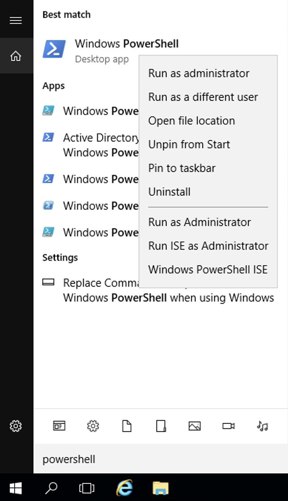

    確認のためのセキュリテイダイアログボックスが表示されたら、**Yes**をクリックしてください。

2. PowerShellコマンドラインから、ネットワーク共有を作成するため、以下のコマンドを入力してください。

        New-SMBShare -Name "Share1" -Path "C:\share1" -FullAccess "Everyone”

    これにより全てのユーザーへのread/writeアクセス件を持った"Share1"というネットワーク共有が作成されます。これはDataSyncがshare1フォルダーをFSxへコピーするための共有です。

#### 3. FSxでの新しいファイル共有の作成

FSxファイルサーバーを新たに作成する時、"share"という名前の共有が自動的に作成されます。FSxファイル共有をどのように管理するかを実際にお見せするために、次のステップに進んで新しいファイル共有を作成します。[FSxドキュメント](https://docs.aws.amazon.com/fsx/latest/WindowsGuide/managing-file-shares.html)で更に詳細を確認出来ます。

1. Windows起動アイコンをクリックし、共有フォルダダイアログボックスを起動するため、"fsmgmt.msc"と入力してください。

    

2. Sharesアイコンをクリックすると、前のステップで作成した**Share1**ネットワーク共有を確認出来ます。

    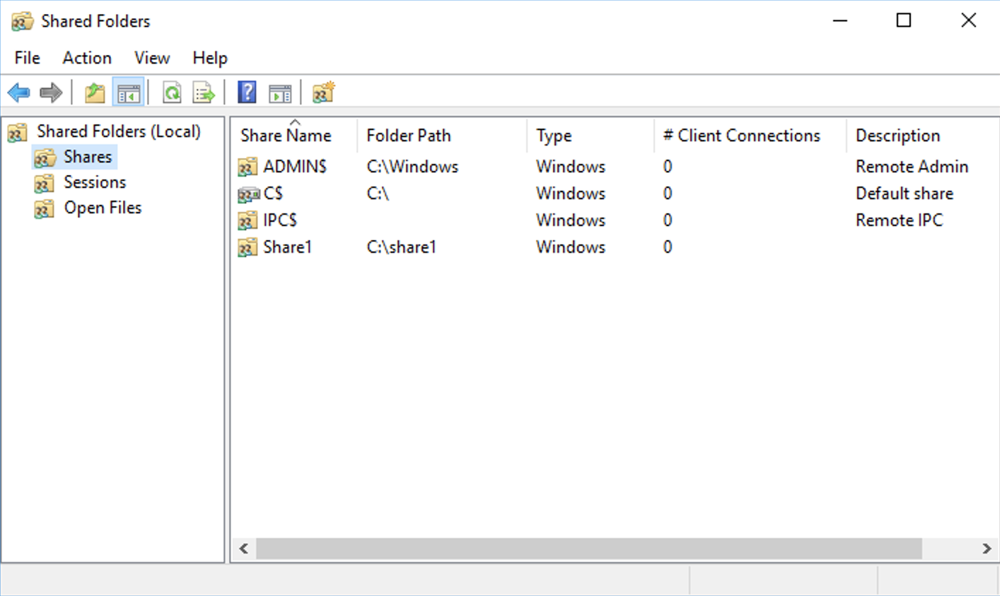

3. FSxサーバーへ接続するため"Shared Folders(Local)"を右クリックし、"Connect to another computer"を選択してください。

    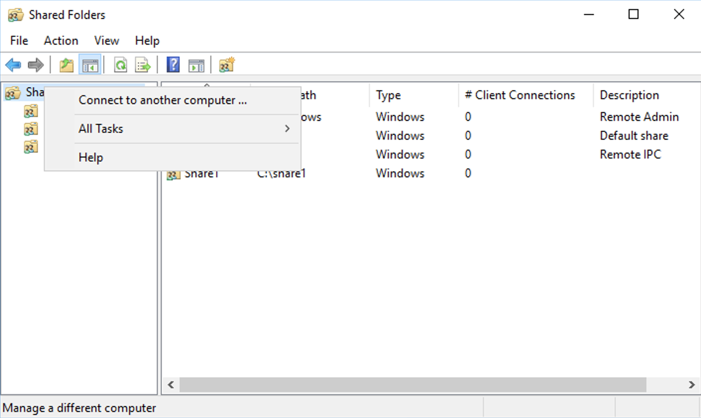

    "Another computer"を選択すると、FSxファイルサーバーのDNS名を入力する必要があります。ファイルサーバーのDNS名はFSxのマネジメントコンソールの**Network＆Security**タブから見つける事が出来ます。

    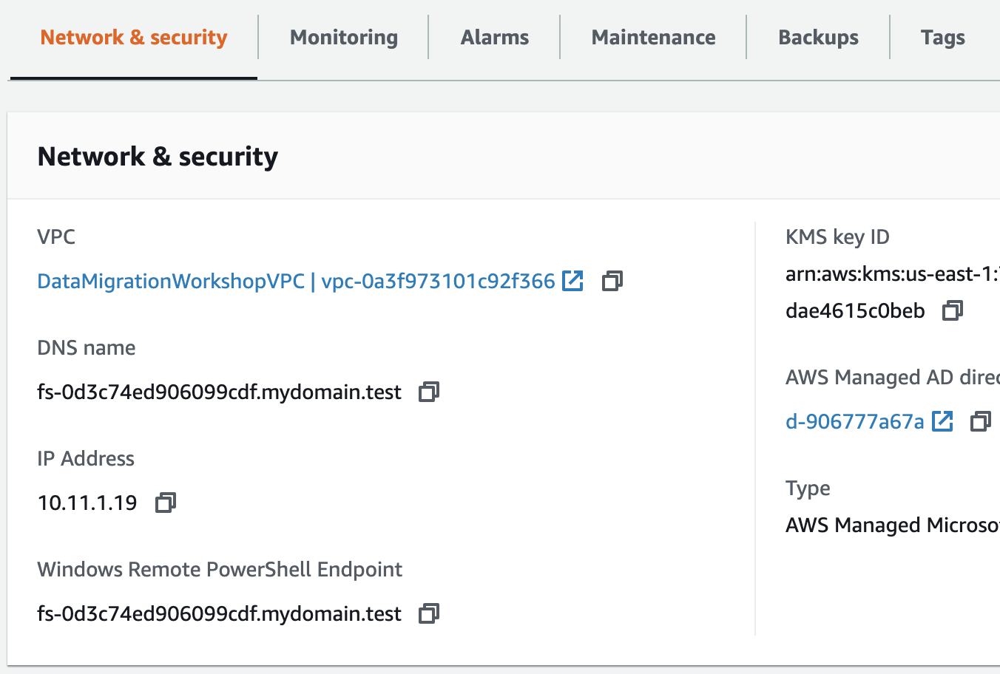

    DNS名をコピーし、ダイアログボックスに入力してOKをクリックしてください。

    

4. 共有フォルダーダイアログボックスでSharesを右クリックし、**New share**を選択して**Next**をクリックしてください。
5. **Folder path**に"D:\share1"を入力して**Next**をクリックしてください。フォルダーの作成を求められたら**Yes**をクリックしてください。
6. 共有の設定はデフォルトのままで**Next**をクリックしてください。
7. 共有フォルダーのアクセス許可では、**Customize permissions**を選択し、**Custom**ボタンをクリックしてください。
8. **Share Permissions**タブで、Everyoneグループが選択されているのを確認し、"フルコントロール"の許可のチェックボックスをONにしてください。

    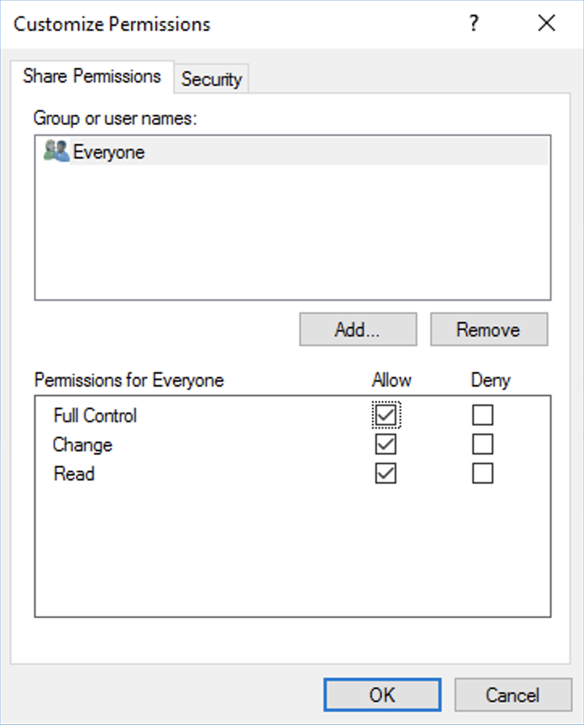

    設定が完了したら**OK**をクリックしてください。
9. 共有フォルダーウィザードに戻り、**Finish**ボタンをクリックし、もう一度**Finish**をクリックしてください。共有リストの中にshare1ネットワーク共有が表れます。

    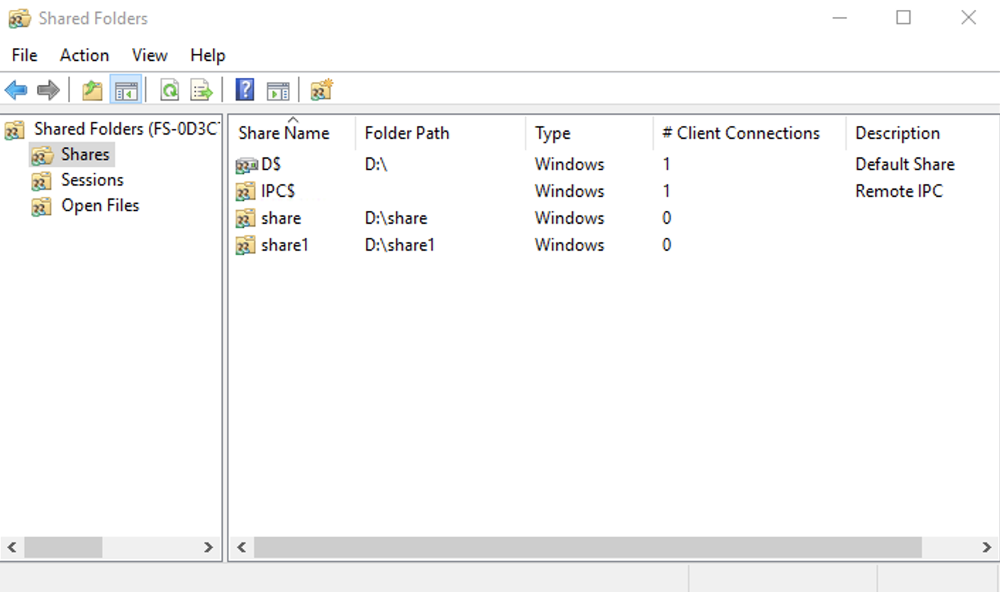

## 最後に確認

完全にFSxにファイルがコピーされた事を確認するために、Windowsサーバーで新しいFSxファイル共有をマウントします。Windowsエクスプローラーを開き、**This PC**を右クリックし、**Map network drive**を選択します。  

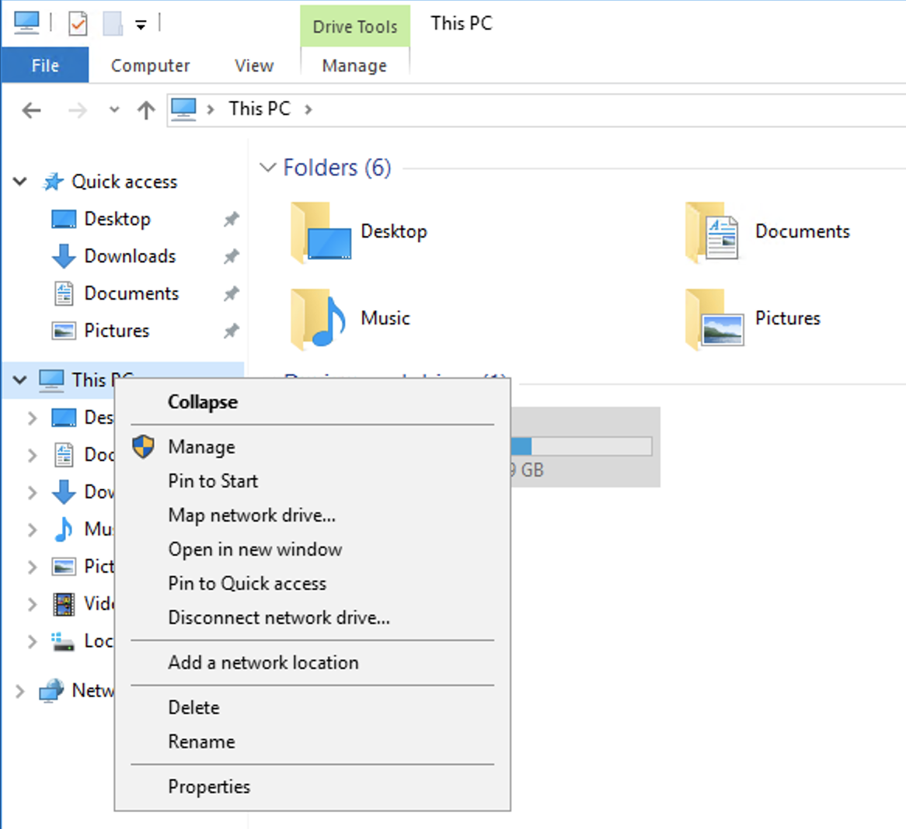

フォルダー欄に"\\\\"に続いてFSxファイルシステムのDNS名を入力し、続けて"\share1"を入力して**Finish**ボタンを押してください。

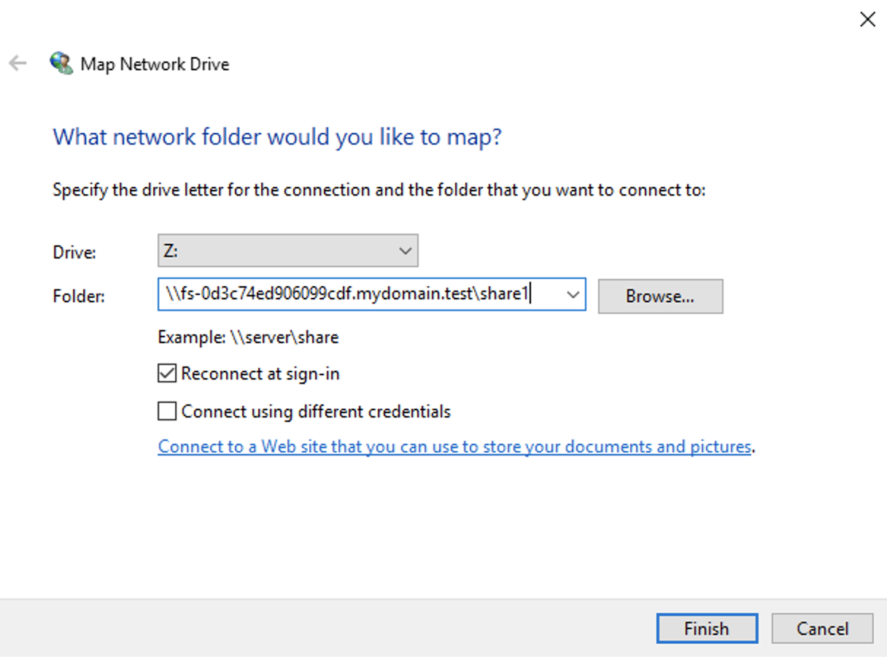

エクスプローラーに空のフォルダーが表示されます。

## このモジュールのまとめ

このモジュールでは、Windowsサーバーのshare1フォルダーの中身を確認し、パーミッションがどのように設定されているかを確認しました。次にネットワーク経由でshare1フォルダーにアクセス出来るよう、Windowsサーバーでネットワーク共有を作成しました。最後にFSxに新たな共有を作成し、Windowsサーバーからマウントさせました。

次のモジュールでは、DataSyncタスクを作成し、共有フォルダのコンテンツをWindowsサーバーからFSxファイルシステムへコピーするためにタスクを実行します。

[モジュール 3](/JP/module3)へ
