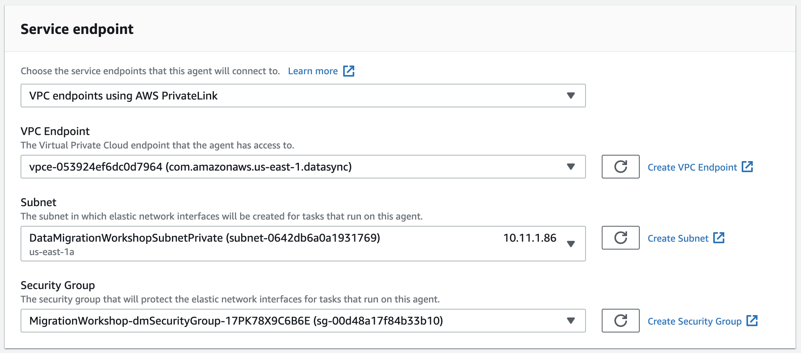
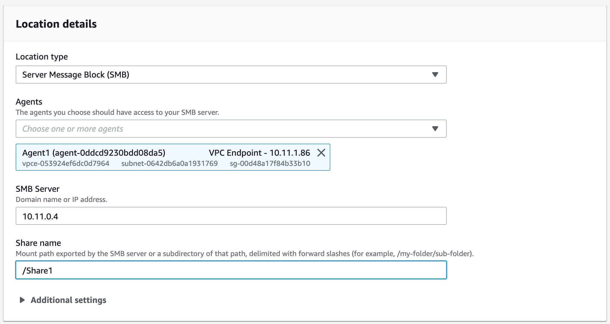
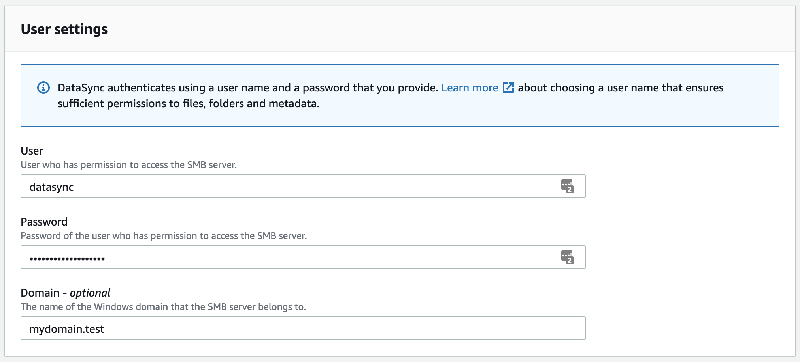
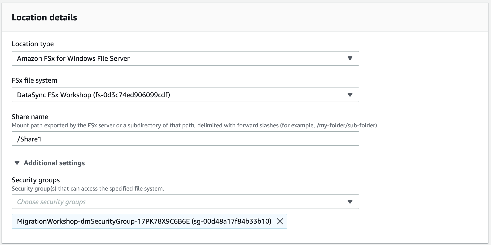
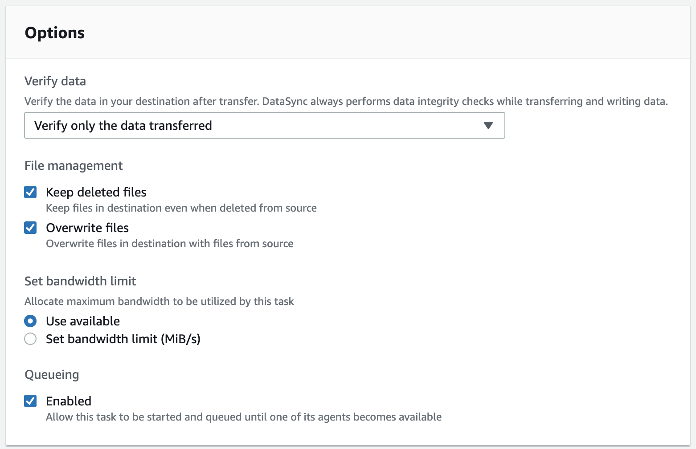
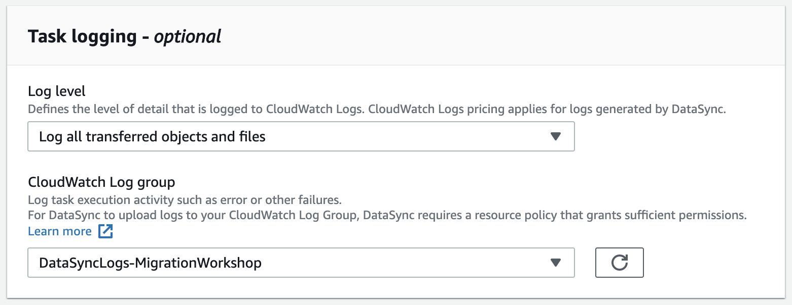
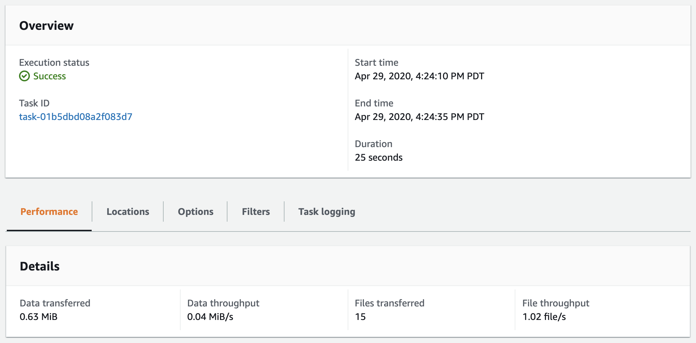
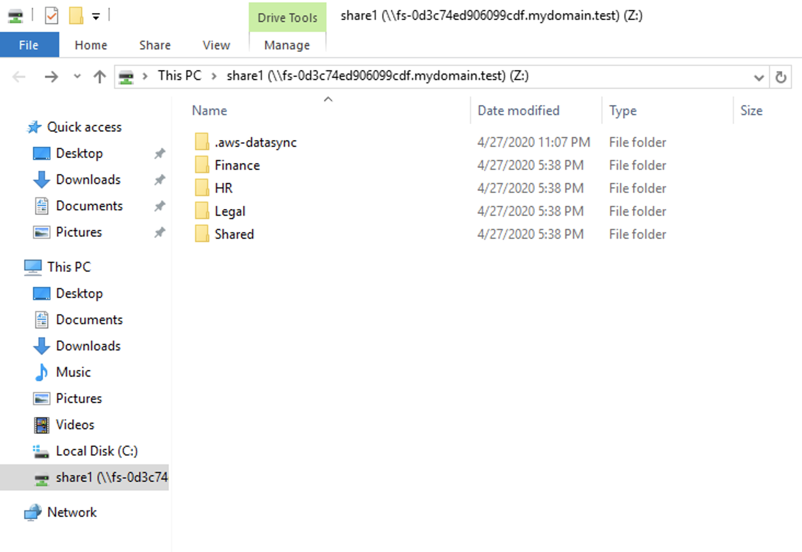

# DataSyncを使ったFSx for Windows File Serverへのマイグレーション

© 2020 Amazon Web Services, Inc. and its affiliates. All rights reserved.
This sample code is made available under the MIT-0 license. See the LICENSE file.

Errors or corrections? Contact [jeffbart@amazon.com](mailto:jeffbart@amazon.com).

---

# モジュール 3
## DataSyncを使ったWindowsファイルサーバーからFSxへのデータコピー

前のモジュールで、WindowsサーバーとFSxの双方にネットワーク共有を作成しました。AWS DataSyncはファイルシステム上のデータにアクセスするためにネットワーク共有を使用します。このモジュールでは、データ転送に使用するDataSyncの設定を行います。はじめに、DataSyncからのログを受け入れるようにCloudWatchのセットアップを行います。次に、DataSyncをアクティベートし、VPCアクセスの設定を行います。最後に、WindowsサーバーからFSxへデータをコピーする新規のタスクをDataSyncに設定します。

## このモジュールの手順

#### 1. DataSyncログを受け入れるようにCloudWatchを設定

DataSyncタスク作成時に、CloudWatchロググループへのログの書き込みを設定する事が出来ます。もしデータ転送中に問題が発生した場合、問題の有ったファイルと共にログが残され、タスク完了時に容易に状況を知る事が出来ます。しかしながら、DataSyncからCloudWatchへのログの書き込みを行うには、事前に適切なリソースポリシーが設定されている必要があります。この設定はDataSyncが動作するリージョン毎に１度だけ必要である点に注意してください。

1. 以下のポリシーを記載したテキストをテキストエディターにコピーし、ローカルマシンにファイルとして保管してください。
(次のステップではAWS CLIを使うため、AWS CLIをまだ使った事のない方は事前設定を行ってください。https://docs.aws.amazon.com/cli/latest/userguide/cli-chap-welcome.html)

        {
            "Statement": [
                {
                    "Sid": "DataSyncLogsToCloudWatchLogs",
                    "Effect": "Allow",
                    "Action": [
                        "logs:PutLogEvents",
                        "logs:CreateLogStream"
                    ],
                    "Principal": {
                        "Service": "datasync.amazonaws.com"
                    },
                    "Resource": "*"
                }
            ],
            "Version": "2012-10-17"
        }

2. コマンドラインターミナルからCloudWatchへポリシーを適用するために以下のコマンドを実行してください。

        aws logs put-resource-policy --region <region> --policy-name trustDataSync --policy-document file://<policy-file>

  \<policy-file\>の部分は前の手順でローカルマシンに保存したファイルで、\<region\>はこのワークショップを実行しているリージョンになります。

#### 2. DataSyncエージェントをアクティベート

最初のモジュールでDataSyncエージェントが動作するEC2インスタンスをデプロイしましたが、実際に使用を開始するにはアクティベーションが必要です。エージェントをアクティベートするには次のステップに従ってください。

1. マネジメントコンソールで**サービス**をクリックし、次に**DataSync**を選択。
2. DataSyncエージェントが存在しない場合は**Get started**ボタンをクリック、それ以外は**Create agent**ボタンをクリック。
3. Service endpoint選択画面で**VPC endpoints using AWS PrivateLink**を選択。これによりエージェントからのVPCへの全てのDataSyncトラフィックに制限をかける事が出来ます。これはオンプレミス環境からAWS DirectConnectやVPNを経由してAWSへ接続する際に有効です。VPCアクセスのためのDataSyncの設定の詳細については[このドキュメント](https://docs.aws.amazon.com/datasync/latest/userguide/datasync-in-vpc.html)を参照ください。
4. VPC Endpointとして、クラウドフォーメーションのアウトプット（出力）タブに表示されるIDと同じIDのエンドポイントを選択してください。このVPCは1つのサブネットと1つのセキュリティグループで構成されているので、これら2つは自動的に選択されます。

    

4. **Activation key**のセクションで、 DataSyncエージェントの**Public IP address**を入力してください。クラウドフォーメーションのアウトプット（出力）からこのIPアドレスを知る事が出来ます。ここでパブリックIPアドレスを使う理由は、アクティベーションのために端末のウェブブラウザからアクセス出来る必要があるためです。もし、ブラウザがルーティングで辿り着けるなら、アクティベーションにプライベートIPアドレスを使う事も可能です。エージェントのパブリックIPアドレスを入力し、**Get key**をクリックしてください。

5. アクティベーションが成功すると、アクティベーションキーが表示され、次の入力に進みます。

    

6. エージェントの名前を入力し、必要ならタグを設定してください。その後、**Create agent**をクリックしてください。

#### 3. ソースロケーションの作成

DataSyncはソースロケーションから宛先ロケーションへデータをコピーします。ロケーションはタスクとは独立して存在し、必要に応じて再利用出来ます。

1. ページの左側で**Locations**を選択し、**Create location**ボタンをクリックしてください。
2. **Location Type**の所で"Server Message Block (SMB)"を選択してください。
3. 前の手順で作成したエージェントを選択してください。**SMB Server**の所で、Windowsサーバーの**Private IP address**を入力してください。クラウドフォーメーションのアウトプット（出力）からこのIPアドレスを知る事が出来ます。**Share name**の所には"/Share1"を入力してください。

    

4. **User settings**の所の**User**には"datasync"を入力し、**Password**にはクラウドフォーメーションで入力したパスワードを入力してください。**Domain**にはクラウドフォーメーションのアウトプット（出力）にほゆ事されるフルドメインを入力してください。これらはAWS DataSyncがWindowsサーバー上のネットワーク共有にアクセスする際に使用されるユーザー情報です。 

    

5. **Create location**をクリックしてください。

**datasync** ADユーザーがクラウドフォーメーションスタックにより自動的に作成され、AWS Delegated FSx Administratorsグループの一員として構成されています。DataSyncは全てのACLのフィールドに読み書き出来る必要があるため、これはとても重要です。AWS Managed ADの環境では、AWS Delegated FSx Administratorsグループがこのような権限を提供します。自己管理しているAD環境を使う場合は、Domain AdminsグループやBackup Operatorsグループが使われます。

#### 3. 宛先ロケーションの作成

1. ページの左側で**Locations**を選択し、**Create location**ボタンをクリックしてください。
2. **Location Type**の所で"Amazon FSx for Windows File Server"を選択してください。
3. "DataSync FSx Workshop"という名前のファイルシステムを選択してください。
4. **Share name**の所に"/share1"を入力してください。
5. **Additional settings**を開いてください。デフォルトセキュリティーグループを削除し、"MigrationWorkshop-dmSecurityGroup"という名前のセキュリティーグループを選択してください。これによりDataSyncサービスからFSxファイルシステムへのアクセスが提供されます。

    

5. **User settings**の所はWindowsのSMBロケーションの設定で使用したものと同じものを使用してください。
6. **Create location**をクリックしてください。

#### 4. DataSyncタスクの作成

1. **Create task**ボタンをクリックしてください。
2. "Choose and existing location"を選択し、前の手順で作成したSMBロケーションを選択してください。これはソースロケーションです。
3. **Next**をクリックしてください。
4. "Choose an existing location"を選択し、前の手順で作成したFSxロケーションを選択してください。これは宛先ロケーションです。
5. **Next**をクリックしてください。
6. タスク名を入力してください。データの検証オプションの所で、"Verify only the data transferred"オプションが選択されている事を確認してください。これが宛先データの検証で最も効率的な方法です。その他のオプションはそのままにしてください。

    

7. **Task logging**セクションまで下にスクロールしてください。**Log level**の所で"Log all transferred objects and files"を選択してください。**CloudWatch Log group**の所で"DataSyncLogs-MigrationWorkshop"という名前のグループを選択してください。

    

8. **Next**をクリックしてください。
9. 全ての設定を確認し、**Create task**をクリックしてください。

#### 2. DatsSyncタスクの起動

1. **Task status**が"Creating"から"Available"になるまでお待ちください。
2. タスクを起動するため、**Start**ボタンをクリックしてください。再度設定を確認し、**Start**をクリックしてください。
3. タスクは直ぐに&quot;Running&quot;ステータスに移行します。
4. **History**タブで、リストの中のタスク実行オブジェクトをクリックしてください。
5. タスクの進行に伴い、実行ステータスが&quot;Launching&quot;、&quot;Preparing&quot;、&quot;Transferring&quot;、&quot;Verifying&quot;、そして最後に&quot;Success&quot;へと変化します。タスクが完了すると、コンソールに以下のようなジョブの統計情報が表示されます。

    

## 最後に確認

Windowsサーバーのリモートデスクトップセッションに戻り、マウントしたFSx上の共有をエクスプローラーで開いてください。Windowsサーバー上のshare1の中身と全く同じものが見えるはずです。また、追加で".aws-datasync"という名前のフォルダーが見えます。これはマイグレーションの過程でDataSyncによって作成されたものです。

様々なファイルやフォルダーのセキュリティプロパティを比較してみてください。Windowsサーバーのものと完全に一致している事が確認できると思います。

## このモジュールのまとめ

このモジュールでは、DataSyncを構成した上でエージェントをアクティベートし、WindowsサーバーからFSxへデータのフルコピーを行いました。コピー完了後、FSx側のフォルダーを確認し、正常にコピーが完了している事を確認しました。

このワークショップでは少量のデータをFSxにコピーしましたが、DataSyncは容易に且つ効率的にスケールできるように設計されています。AWSのお客様はDataSyncを使って、ペタバイトクラスのデータをオンプレミスからAWSのクラウドストレージ（Amazon S3、Amazon EFS、Amazon FSx）へ移行されています。 AWS DataSyncがどのようにデータマイグレーションプロジェクトに貢献できるかの詳細は、 [DataSyncプロダクトページ](https://aws.amazon.com/datasync/)を御覧下さい。

次のモジュールでは、このワークショップで使用した全てのリソースをクリーンアップします。

[モジュール 4](/module4)へ
